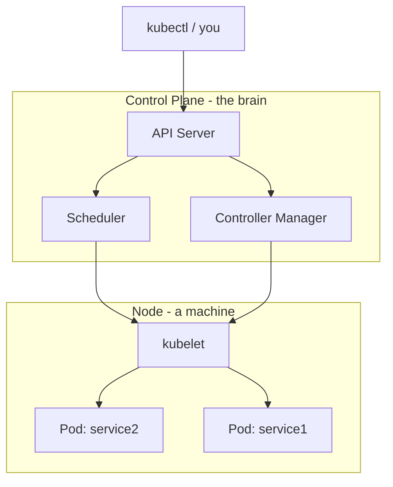

# Step 0: Kubernetes Mental Model

**Goal:** Understand what Kubernetes is, how it relates to Docker, and the core vocabulary you will use in every later step.

**Time:** ~20–30 minutes reading. No cluster or commands required yet.

**Your project context:**

| What you run today | Port | Role |
|--------------------|------|------|
| `service1` (Users) | 3000 | Users API; calls Products service over HTTP |
| `service2` (Products) | 3001 | Products API |

On your Mac you start each app with `rails s`. In Kubernetes we will run the **same apps inside containers**, but Kubernetes decides *where* they run, *how* they restart, and *how* they find each other.

---

## What problem does Kubernetes solve?

Running two Rails apps on your laptop is simple. Running them in production gets harder:

- A server crashes — who restarts the app?
- You need a second copy for traffic — how do you add it?
- service1 needs to reach service2 — what if service2’s IP changes?
- You deploy a new image — how do you roll out without downtime?
- Secrets (`RAILS_MASTER_KEY`) — where do they live safely?

**Kubernetes is a platform that answers these questions.** You describe the *desired state* (“I want 2 copies of service2, always reachable at `products-service`”), and Kubernetes continuously works to match reality to that description.

---

## Docker vs Kubernetes (the short version)

| | Docker | Kubernetes |
|---|--------|------------|
| **Unit of work** | Container (one running process/image) | Pod (usually one container; sometimes more) |
| **Who starts it** | You: `docker run` | Kubernetes scheduler places it on a Node |
| **Networking** | You pick ports: `-p 3000:80` | Services give stable DNS names inside the cluster |
| **Restarts** | `--restart unless-stopped` (basic) | Deployments recreate failed Pods automatically |
| **Scaling** | Start more containers manually | Change `replicas: 3` in a manifest |
| **Config** | `-e VAR=value` on CLI | ConfigMaps and Secrets in YAML |

**Important:** Kubernetes does **not** replace Docker. It **orchestrates** containers. Your Rails apps are still packaged as Docker images (you already have Dockerfiles). Kubernetes pulls those images and runs them as Pods.

```
You write YAML  →  kubectl apply  →  Kubernetes  →  Docker runs containers on Nodes
```

---

## The cluster at a glance



On a **local learning cluster** (kind), the control plane and one node often run inside Docker on your Mac. In production, control plane and nodes are usually separate machines.

---

## Core vocabulary (memorize these)

### Cluster

The entire Kubernetes system: control plane + all nodes. When we say “deploy to the cluster,” we mean “tell Kubernetes to run our workloads somewhere inside this system.”

### Node

A worker machine (physical or virtual) that runs Pods. Your kind cluster will start with one node. Production clusters have many.

### Control plane

The “brain” of the cluster. It stores configuration, schedules work, and reacts when things break. You rarely touch it directly; you talk to it through `kubectl`.

### Pod

The **smallest deployable unit** in Kubernetes.

- Usually **one container** (our Rails app).
- Pods get a unique IP inside the cluster.
- Pods are **ephemeral** — they die and get replaced. Do not treat a Pod like a long-lived server.

> **Analogy:** A Pod is like a single running `docker run` instance, but Kubernetes manages its lifecycle.

### Deployment

A higher-level object that manages Pods for you.

- You say: “Keep **2 replicas** of service2 running this image.”
- If a Pod crashes, the Deployment creates a new one.
- Rolling updates: deploy a new image version gradually.

You will almost never create a bare Pod in production; you use a Deployment.

### Service

Pods come and go; their IP addresses change. A **Service** gives a **stable name and IP** (e.g. `products-service`) that other Pods use to connect.

- **ClusterIP** (default): reachable only inside the cluster — perfect for service1 → service2.
- **NodePort / LoadBalancer / Ingress**: ways to expose apps to the outside world (we add these later).

> **For your project:** service1 will call `http://products-service` (Kubernetes DNS), not `http://localhost:3001`.

### Namespace

A virtual cluster inside the cluster. Used to group related resources and avoid name clashes.

We will use a namespace called `microservices` for both Rails services.

### ConfigMap

Non-secret configuration as key-value pairs (e.g. `RAILS_ENV=production`, `PRODUCTS_SERVICE_URL=http://products-service`).

### Secret

Like a ConfigMap, but intended for sensitive data (e.g. `RAILS_MASTER_KEY`). Stored encoded in etcd; still not encryption at rest by default — treat cluster access carefully.

### PersistentVolumeClaim (PVC)

A request for disk storage that survives Pod restarts. Needed for your SQLite files in `storage/`.

### Ingress

HTTP routing from outside the cluster to Services (e.g. `/users` → service1, `/products` → service2). Optional in early steps; we use `kubectl port-forward` first because it is simpler.

### kubectl

The command-line tool you use to talk to the cluster: apply manifests, inspect Pods, view logs, port-forward.

### Manifest / YAML

A file that describes a Kubernetes object (`Deployment`, `Service`, etc.). You run:

```bash
kubectl apply -f path/to/file.yaml
```

Kubernetes stores that desired state and makes it happen.

---

## How your two services map to Kubernetes objects

This is the target architecture we will build step by step:

```
Namespace: microservices
│
├── Deployment: users-service      (service1 Rails app)
│   └── Pod(s)                     container port 80
│   └── env: RAILS_MASTER_KEY, PRODUCTS_SERVICE_URL
│   └── volume: PVC for SQLite
│
├── Service: users-service         ClusterIP, port 80
│
├── Deployment: products-service   (service2 Rails app)
│   └── Pod(s)
│   └── env: RAILS_MASTER_KEY
│   └── volume: PVC for SQLite
│
└── Service: products-service      ClusterIP, port 80
```

**Traffic flow:**

1. **You → service1:** `kubectl port-forward` (later: Ingress) → `users-service` → Pod.
2. **service1 → service2:** Pod calls `http://products-service/api/v1/products` → Service load-balances to a products Pod.

---

## Declarative vs imperative

Kubernetes is **declarative**: you declare *what* you want, not *how* to do it.

| Imperative (Docker habit) | Declarative (Kubernetes habit) |
|---------------------------|--------------------------------|
| `docker run -p 3000:80 ...` | `kubectl apply -f deployment.yaml` |
| `docker stop mycontainer` | Edit YAML or `kubectl delete -f ...` |

After `apply`, Kubernetes reconciles: if a Pod dies, it creates another. You do not SSH in and restart Puma manually.

---

## What stays the same from your current setup

| Already in your repo | Role in Kubernetes |
|----------------------|-------------------|
| `service1/Dockerfile`, `service2/Dockerfile` | Build images Kubernetes runs |
| `bin/docker-entrypoint` | Runs `db:prepare` on boot |
| `GET /up` health route | Liveness/readiness probes (Step 10) |
| SQLite in `storage/` | Mounted via PersistentVolumeClaim (Step 7) |
| `ProductService` HTTP call | URL becomes env var pointing at K8s Service (Step 9) |

---

## Common beginner misconceptions

| Misconern | Reality |
|-----------|---------|
| “I need to learn every Kubernetes object.” | Start with Namespace, Deployment, Service, Secret, PVC. That covers 80% of this project. |
| “Kubernetes replaces my Dockerfile.” | No. You still build images; K8s runs them. |
| “I use the same ports as locally (3000, 3001).” | Inside the cluster, both apps listen on **80** (Thruster in your Dockerfile). Services map port 80. You only use 3000/3001 on your Mac via port-forward for convenience. |
| “Pods are like VMs.” | Pods are lightweight and disposable. Data goes on volumes, not inside the Pod filesystem. |
| “localhost works between services.” | Inside a Pod, `localhost` is **that Pod only**. Services use DNS names. |

---

## Glossary quick reference

| Term | One-line definition |
|------|---------------------|
| **Pod** | One or more containers sharing network/storage; smallest deployable unit |
| **Deployment** | Manages replicated Pods and rolling updates |
| **Service** | Stable network endpoint for a set of Pods |
| **Node** | Machine that runs Pods |
| **Cluster** | All nodes + control plane |
| **Namespace** | Logical partition for resources |
| **ConfigMap** | Non-secret config |
| **Secret** | Sensitive config |
| **PVC** | Request for persistent disk |
| **Ingress** | HTTP routing into the cluster |
| **kubectl** | CLI for the cluster |
| **kind** | Tool to run a local cluster inside Docker |
| **imagePullPolicy** | When to pull an image (`Never` for local kind images) |

---

## Self-check (before Step 1)

Answer these without looking; if any are shaky, re-read the section above.

1. What is the difference between a Pod and a Deployment?
2. Why does service1 need a Service name for service2 instead of an IP?
3. Where will `RAILS_MASTER_KEY` live in Kubernetes?
4. Why do we need a PVC for SQLite?
5. What tool will you use to create a local cluster in Step 1?

<details>
<summary>Answers</summary>

1. A Pod is a single running instance; a Deployment keeps the desired number of Pods running and handles updates.
2. Pod IPs change when Pods restart. A Service provides a stable DNS name.
3. In a **Secret**, referenced by the Deployment as an environment variable.
4. Pods are ephemeral; without a volume, database files are lost when a Pod is replaced.
5. **kind** (Kubernetes in Docker).

</details>

---

## Next step

**Step 1:** Install Docker, `kubectl`, and `kind`; create your first local cluster.

See: [01-cluster-setup.md](./01-cluster-setup.md) *(created in the next session)*

---

## Repeat later

This step is read-only. To revisit:

1. Open this file.
2. Skim **Core vocabulary** and **How your two services map to Kubernetes objects**.
3. Complete the self-check.
4. Proceed to Step 1 when ready.
