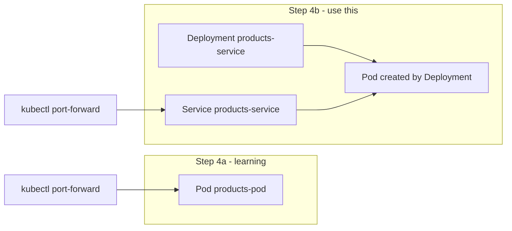

# Step 4: Deploy service2 (Products)

**Goal:** Deploy the Products Rails app to Kubernetes — first as a bare Pod (to learn), then as a Deployment + Service (the real pattern). Reach the API from your Mac with `kubectl port-forward`.

**Time:** ~30–45 minutes.

**Prerequisites:**

- [Step 3 – Build and Load Images](./03-build-and-load-images.md) — `service2:local` built and loaded into kind
- Cluster `microservices` running

---

## What you will create

```
k8s/
├── namespace.yaml
└── service2/
    ├── pod.yaml          # Step 4a — learning only
    ├── deployment.yaml   # Step 4b — keeps Pods running
    └── service.yaml      # Step 4b — stable DNS name
```

| Object | Name | Purpose |
|--------|------|---------|
| Namespace | `microservices` | Groups all project resources |
| Secret | `products-service-secrets` | `RAILS_MASTER_KEY` decrypts Rails credentials |
| Pod | `products-pod` | Temporary — see one container running |
| Deployment | `products-service` | Manages Products Pods, restarts on failure |
| Service | `products-service` | Stable cluster IP + DNS for port 80 |

---

## 1. Confirm prerequisites

```bash
kubectl config use-context kind-microservices
docker images | grep service2
kind get clusters
```

Rebuild and reload if needed:

```bash
docker build -t service2:local ./service2
kind load docker-image service2:local --name microservices
```

---

## 2. Create the namespace

```bash
kubectl apply -f k8s/namespace.yaml
```

Verify:

```bash
kubectl get ns microservices
```

---

## 3. Create a Secret

Rails production mode needs `RAILS_MASTER_KEY` to decrypt `config/credentials.yml.enc` inside the image.

From the `microservices-ruby` repo root:

```bash
kubectl create secret generic products-service-secrets \
  --from-literal=RAILS_MASTER_KEY="$(cat service2/config/master.key)" \
  -n microservices
```

Verify (shows the Secret exists, not the value):

```bash
kubectl get secret products-service-secrets -n microservices
```

### Prerequisites: `master.key` must match `credentials.yml.enc`

`config/master.key` (local, gitignored) must be the key that encrypted `config/credentials.yml.enc` (in git). If they do not match, the Pod crashes with:

```
ActiveSupport::MessageEncryptor::InvalidMessage
```

**Fix a mismatch** (in the `service2` repo):

```bash
cd service2
git checkout main
rm -f config/master.key config/credentials.yml.enc
EDITOR="vi" bin/rails credentials:edit   # save and quit — creates a new matched pair
```

Then rebuild and reload the image (Step 3), recreate the Secret above, and redeploy.

**Never commit `config/master.key` to git.** Only the encrypted `credentials.yml.enc` is committed. The Kubernetes Secret holds the key at runtime.

### Updating an existing Secret

If the Secret already exists (e.g. from an earlier attempt), apply an update:

```bash
kubectl create secret generic products-service-secrets \
  --from-literal=RAILS_MASTER_KEY="$(cat service2/config/master.key)" \
  -n microservices \
  --dry-run=client -o yaml | kubectl apply -f -
```

A one-time warning about `last-applied-configuration` is normal. Then restart Pods:

```bash
kubectl rollout restart deployment/products-service -n microservices
```

---

## 4a. Bare Pod (learning)

A **Pod** is the smallest unit — one or more containers. We start here to see how image + env + port fit together.

```bash
kubectl apply -f k8s/service2/pod.yaml
```

Watch until Ready:

```bash
kubectl get pod products-pod -n microservices -w
# Ctrl+C when READY is 1/1
```

Inspect:

```bash
kubectl describe pod products-pod -n microservices
kubectl logs products-pod -n microservices --tail=20
```

**Healthy logs look like this:**

```
{"time":"...","level":"INFO","msg":"Server started","http":":80"}
=> Booting Puma
=> Rails 8.1.3 application starting in production
Puma starting in single mode...
* Listening on http://0.0.0.0:3000
```

| Log line | Meaning |
|----------|---------|
| `Server started","http":":80"` | Thruster proxy listening on port 80 (what Kubernetes targets) |
| `Listening on http://0.0.0.0:3000` | Puma behind Thruster — normal |
| `image_processing gem` warning | Harmless for this API — Active Storage variants are unused; safe to ignore |

### Port-forward to the Pod

**Terminal 1** — leave this running:

```bash
kubectl port-forward -n microservices pod/products-pod 3001:80
```

Expected:

```
Forwarding from 127.0.0.1:3001 -> 80
Forwarding from [::1]:3001 -> 80
```

**Terminal 2** — test while port-forward is still active (`Ctrl+C` in terminal 1 stops access):

```bash
curl http://localhost:3001/up
# Expected: 200 (empty body)

curl http://localhost:3001/api/v1/products
# Expected: []
```

Press `Ctrl+C` in **terminal 1** to stop port-forward when done.

### Delete the bare Pod

Deployments are preferred in practice. Remove the learning Pod:

```bash
kubectl delete -f k8s/service2/pod.yaml
```

---

## 4b. Deployment + Service (real pattern)

### Deployment

A **Deployment** keeps the desired number of Pods running. If a Pod crashes, Kubernetes creates a new one.

```bash
kubectl apply -f k8s/service2/deployment.yaml
```

```bash
kubectl rollout status deployment/products-service -n microservices
kubectl get pods -n microservices -l app=products-service
```

Example:

```
NAME                               READY   STATUS    RESTARTS   AGE
products-service-c9bff8768-d2bn2   1/1     Running   0          30s
```

### Service

Pods get new IPs when recreated. A **Service** provides a stable name (`products-service`) and load-balances to matching Pods.

```bash
kubectl apply -f k8s/service2/service.yaml
```

```bash
kubectl get svc products-service -n microservices
```

Example:

```
NAME               TYPE        CLUSTER-IP   PORT(S)   AGE
products-service   ClusterIP   10.96.23.9   80/TCP    10s
```

Inside the cluster, other Pods reach this app at:

```
http://products-service.microservices.svc.cluster.local
# or short form within the same namespace:
http://products-service
```

### Port-forward to the Service

Prefer forwarding to the **Service** (works even when Pods are replaced):

```bash
kubectl port-forward -n microservices svc/products-service 3001:80
```

Test the API:

```bash
# Health check
curl -s -o /dev/null -w "%{http_code}\n" http://localhost:3001/up

# List products (empty at first)
curl http://localhost:3001/api/v1/products

# Create a product
curl -X POST -H "Content-Type: application/json" \
  -d '{"product":{"name":"Book","price":"19.99"}}' \
  http://localhost:3001/api/v1/products

# List again
curl http://localhost:3001/api/v1/products
```

Expected create response:

```json
{"id":1,"name":"Book","price":"19.99","created_at":"...","updated_at":"..."}
```

---

## Manifest walkthrough

### `pod.yaml` / `deployment.yaml` (container spec)

Key fields:

```yaml
image: service2:local
imagePullPolicy: Never      # use image loaded into kind; do not pull from registry
ports:
  - containerPort: 80       # Thruster listens on 80 in the container
env:
  - name: RAILS_MASTER_KEY
    valueFrom:
      secretKeyRef:
        name: products-service-secrets
        key: RAILS_MASTER_KEY
```

`imagePullPolicy: Never` is required for local kind images. Without it: `ErrImagePull`.

### `deployment.yaml` (extra fields)

```yaml
replicas: 1
selector:
  matchLabels:
    app: products-service
template:
  metadata:
    labels:
      app: products-service   # must match selector
```

The Deployment creates Pods with label `app: products-service`.

### `service.yaml`

```yaml
selector:
  app: products-service   # routes traffic to Pods with this label
ports:
  - port: 80              # Service port
    targetPort: 80        # container port
type: ClusterIP           # internal only (default)
```

---

## Pod vs Deployment vs Service



| Object | Restarts on crash? | Stable DNS? | Use in production? |
|--------|-------------------|-------------|-------------------|
| Pod | No | No | Rarely |
| Deployment | Yes (new Pod) | No | Yes |
| Service | N/A | Yes | Yes |

---

## Useful commands

```bash
# Everything for products in one view
kubectl get all -n microservices -l app=products-service

# Logs (Deployment Pod name changes — use label)
kubectl logs -n microservices -l app=products-service --tail=50 -f

# Restart after image rebuild
kubectl rollout restart deployment/products-service -n microservices

# Delete everything from this step
kubectl delete -f k8s/service2/deployment.yaml -f k8s/service2/service.yaml
kubectl delete secret products-service-secrets -n microservices
# kubectl delete -f k8s/namespace.yaml   # only if removing entire namespace
```

---

## Troubleshooting

### `ErrImagePull` / `ImagePullBackOff`

```bash
kind load docker-image service2:local --name microservices
# Ensure manifest has imagePullPolicy: Never
```

### `CrashLoopBackOff` + `InvalidMessage`

`RAILS_MASTER_KEY` does not match `credentials.yml.enc` in the image. Regenerate a matched pair with `bin/rails credentials:edit` in `service2`, commit `credentials.yml.enc`, rebuild the image, reload into kind, recreate the Secret, and restart the Deployment.

### `CreateContainerConfigError`

Secret missing or wrong key name — expect `RAILS_MASTER_KEY`, not `SECRET_KEY_BASE`:

```bash
kubectl get secret products-service-secrets -n microservices -o jsonpath='{.data}' | jq 'keys'
kubectl describe pod -n microservices -l app=products-service
```

### `connection refused` on port-forward

Rails may still be booting (`db:prepare` runs on start). Wait a few seconds and check logs:

```bash
kubectl logs -n microservices -l app=products-service --tail=30
```

Look for `Server started` and `Listening on`.

### Product data disappears after Pod restart

SQLite lives inside the container filesystem for now. **Step 7** adds a PersistentVolumeClaim so the database survives restarts.

---

## Repeat later (checklist)

- [ ] `kubectl config use-context kind-microservices`
- [ ] `docker build -t service2:local ./service2 && kind load docker-image service2:local --name microservices`
- [ ] `config/master.key` matches `config/credentials.yml.enc` in `service2`
- [ ] `kubectl apply -f k8s/namespace.yaml`
- [ ] Create `products-service-secrets` with `RAILS_MASTER_KEY` from `service2/config/master.key`
- [ ] Optional: apply `pod.yaml`, port-forward, delete Pod
- [ ] `kubectl apply -f k8s/service2/deployment.yaml -f k8s/service2/service.yaml`
- [ ] `kubectl port-forward -n microservices svc/products-service 3001:80`
- [ ] `curl http://localhost:3001/api/v1/products` works

---

## Next step

**Step 5:** Refine secrets and configuration (ConfigMaps), and prepare for service1 → service2 communication.

See: [05-secrets-and-config.md](./05-secrets-and-config.md) *(next session)*
