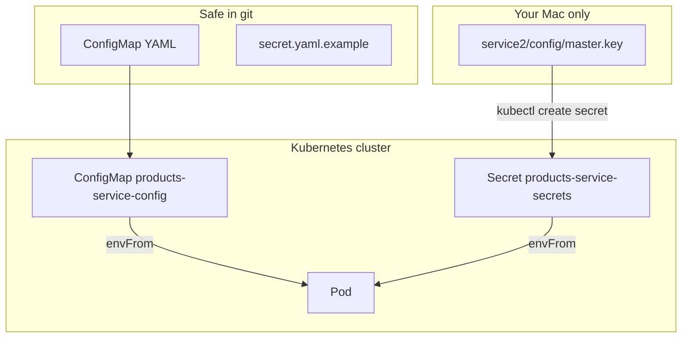

# Step 5: Secrets, ConfigMaps & Service Discovery

**Goal:** Split configuration into **Secrets** (sensitive) and **ConfigMaps** (non-sensitive), load them cleanly with `envFrom`, and prepare **service1 → service2** communication over Kubernetes DNS.

**Time:** ~30 minutes.

**Prerequisites:**

- [Step 4 – Deploy service2](./04-deploy-service2.md) — `products-service` Deployment running

---

## What you will learn

| Object | Stores | Example |
|--------|--------|---------|
| **Secret** | Sensitive values | `RAILS_MASTER_KEY` |
| **ConfigMap** | Non-sensitive config | `RAILS_LOG_LEVEL`, `PRODUCTS_SERVICE_URL` |

Both can be injected into Pods as environment variables.

---

## New files

```
k8s/
├── service1/
│   ├── configmap.yaml         # ready for Step 6+ (users service)
│   └── secret.yaml.example    # template — never apply with real keys
└── service2/
    ├── configmap.yaml         # applied in this step
    ├── deployment.yaml        # updated to use envFrom
    └── secret.yaml.example    # template — never apply with real keys
```

**Code change (service1 repo):** `ProductService` reads `PRODUCTS_SERVICE_URL` instead of hardcoded `localhost:3001`.

---

## ConfigMap vs Secret



| | ConfigMap | Secret |
|---|-----------|--------|
| **Purpose** | App settings, URLs, feature flags | Passwords, API keys, `RAILS_MASTER_KEY` |
| **In git?** | Yes (YAML in `k8s/`) | **No** — use `.example` template + `kubectl create` |
| **At rest in etcd** | Plain text (base64 in API) | Base64 encoded (not encryption by default) |
| **Apply with** | `kubectl apply -f configmap.yaml` | `kubectl create secret ...` from local file |

---

## 1. Products ConfigMap

`k8s/service2/configmap.yaml`:

```yaml
apiVersion: v1
kind: ConfigMap
metadata:
  name: products-service-config
  namespace: microservices
data:
  RAILS_ENV: production
  RAILS_LOG_LEVEL: info
```

Apply:

```bash
kubectl apply -f k8s/service2/configmap.yaml
```

Verify:

```bash
kubectl get configmap products-service-config -n microservices -o yaml
```

---

## 2. Secret (recap — imperative create)

Secrets stay **out of git**. Use the example file as documentation only:

`k8s/service2/secret.yaml.example` — shows structure, `replace-me` placeholder.

Create the real Secret from your local key:

```bash
kubectl create secret generic products-service-secrets \
  --from-literal=RAILS_MASTER_KEY="$(cat service2/config/master.key)" \
  -n microservices
```

If it already exists from Step 4, skip or update:

```bash
kubectl create secret generic products-service-secrets \
  --from-literal=RAILS_MASTER_KEY="$(cat service2/config/master.key)" \
  -n microservices \
  --dry-run=client -o yaml | kubectl apply -f -
```

---

## 3. Load config with `envFrom`

Instead of listing each env var, reference whole ConfigMaps and Secrets.

**Before (Step 4):**

```yaml
env:
  - name: RAILS_MASTER_KEY
    valueFrom:
      secretKeyRef:
        name: products-service-secrets
        key: RAILS_MASTER_KEY
```

**After (Step 5):**

```yaml
envFrom:
  - configMapRef:
      name: products-service-config
  - secretRef:
      name: products-service-secrets
```

Every key in the ConfigMap/Secret becomes an environment variable in the container.

Apply the updated Deployment:

```bash
kubectl apply -f k8s/service2/deployment.yaml
kubectl rollout status deployment/products-service -n microservices
```

Verify env inside the Pod (does not print secret values if you only check names):

```bash
kubectl exec -n microservices deploy/products-service -- sh -c \
  'echo RAILS_LOG_LEVEL=$RAILS_LOG_LEVEL; test -n "$RAILS_MASTER_KEY" && echo RAILS_MASTER_KEY=set'
```

Expected:

```
RAILS_LOG_LEVEL=info
RAILS_MASTER_KEY=set
```

---

## 4. Kubernetes DNS — how services find each other

Inside the cluster, each **Service** gets a DNS name:

```
<service-name>.<namespace>.svc.cluster.local
```

Short form (same namespace `microservices`):

```
http://products-service
```

| Where | URL for Products API |
|-------|---------------------|
| Your Mac (port-forward) | `http://localhost:3001` |
| Inside cluster (service1 → service2) | `http://products-service` |
| Wrong in a Pod | `http://localhost:3001` (points at itself) |

### Test DNS from another Pod

```bash
kubectl run dns-check --image=busybox:1.36 --restart=Never -n microservices \
  --command -- wget -qO- http://products-service/api/v1/products

kubectl wait --for=condition=Ready pod/dns-check -n microservices --timeout=60s
kubectl logs dns-check -n microservices
kubectl delete pod dns-check -n microservices
```

Expected: `[]` (empty JSON array — API reachable).

---

## 5. Prepare service1 (Users) for cluster networking

### ConfigMap (not deployed yet — ready for next step)

`k8s/service1/configmap.yaml`:

```yaml
data:
  RAILS_ENV: production
  RAILS_LOG_LEVEL: info
  PRODUCTS_SERVICE_URL: http://products-service
```

`http://products-service` resolves to the Products Service on port 80 (Thruster inside the Pod).

### Code change in service1

`app/services/product_service.rb` now uses an environment variable with a local fallback:

```ruby
base_url = ENV.fetch("PRODUCTS_SERVICE_URL", "http://localhost:3001")
```

| Environment | `PRODUCTS_SERVICE_URL` | Behavior |
|-------------|--------------------------|----------|
| Local `rails s` | unset | Falls back to `http://localhost:3001` |
| Kubernetes | `http://products-service` | Calls Products via cluster DNS |

Commit this in the **service1** submodule repo.

### Secret template for service1

When you deploy Users in a later step:

```bash
kubectl create secret generic users-service-secrets \
  --from-literal=RAILS_MASTER_KEY="$(cat service1/config/master.key)" \
  -n microservices
```

See `k8s/service1/secret.yaml.example`.

---

## 6. Updating configuration

### Change a ConfigMap value

1. Edit `k8s/service2/configmap.yaml`
2. `kubectl apply -f k8s/service2/configmap.yaml`
3. Restart Pods (env is set at container start):

```bash
kubectl rollout restart deployment/products-service -n microservices
```

### Change a Secret

Recreate or `kubectl apply` the Secret, then `rollout restart`.

---

## Inspect resources

```bash
# ConfigMaps and Secrets in namespace
kubectl get configmap,secret -n microservices

# Decode ConfigMap (safe to view)
kubectl get configmap products-service-config -n microservices -o yaml

# Secret keys only (not values)
kubectl get secret products-service-secrets -n microservices -o jsonpath='{.data}' | jq 'keys'
```

---

## Troubleshooting

### Pod `CreateContainerConfigError`

ConfigMap or Secret name mismatch — check `envFrom` names match:

```bash
kubectl describe pod -n microservices -l app=products-service
```

### Env var not updated after ConfigMap change

Restart the Deployment — running containers do not pick up ConfigMap edits automatically.

### `products-service` DNS fails from Pod

```bash
kubectl get svc products-service -n microservices
kubectl get endpoints products-service -n microservices
```

Endpoints must list a Pod IP. If empty, check Deployment labels match Service `selector`.

### Accidentally applied `secret.yaml.example`

Delete and recreate with the real key:

```bash
kubectl delete secret products-service-secrets -n microservices
kubectl create secret generic products-service-secrets \
  --from-literal=RAILS_MASTER_KEY="$(cat service2/config/master.key)" \
  -n microservices
kubectl rollout restart deployment/products-service -n microservices
```

---

## Repeat later (checklist)

- [ ] `kubectl apply -f k8s/service2/configmap.yaml`
- [ ] Secret `products-service-secrets` exists with `RAILS_MASTER_KEY`
- [ ] `kubectl apply -f k8s/service2/deployment.yaml`
- [ ] `kubectl exec` shows `RAILS_LOG_LEVEL=info` and master key set
- [ ] `dns-check` pod reaches `http://products-service/api/v1/products`
- [ ] `service1` ConfigMap + `ProductService` env change committed in submodule

---

## Next step

**Step 6:** Deploy service1 (Users) using the same ConfigMap + Secret pattern, and verify cross-service call `GET /api/v1/products` through Users.

See: [06-deploy-service1.md](./06-deploy-service1.md) *(next session)*
