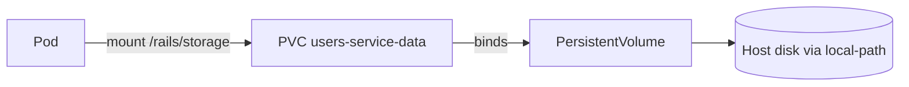

# Step 7: Persistent Storage (SQLite)

**Goal:** Mount persistent disks so SQLite databases in `storage/` survive Pod restarts and Deployments rollouts.

**Time:** ~25 minutes.

**Prerequisites:**

- [Step 6 – Deploy service1](./06-deploy-service1.md) — both services running

---

## The problem

Without a volume, SQLite files live **inside the Pod filesystem**:

```
Pod deleted / restarted  →  storage/production.sqlite3  →  gone
```

After Step 6, creating a user or product and then `kubectl rollout restart` would wipe the database. Step 7 fixes that.

---

## What you will create

```
k8s/
├── service1/
│   ├── pvc.yaml              # users-service-data (1Gi)
│   └── deployment.yaml       # mount at /rails/storage
└── service2/
    ├── pvc.yaml              # products-service-data (1Gi)
    └── deployment.yaml       # mount at /rails/storage
```

Rails production SQLite paths (from `config/database.yml`):

| File | Purpose |
|------|---------|
| `storage/production.sqlite3` | Main app data |
| `storage/production_cache.sqlite3` | Solid Cache |
| `storage/production_queue.sqlite3` | Solid Queue |
| `storage/production_cable.sqlite3` | Solid Cable |

All live under `storage/` — one mount covers them all.

---

## Kubernetes storage concepts



| Term | Meaning |
|------|---------|
| **PersistentVolumeClaim (PVC)** | "I need 1Gi of disk" — you create this |
| **PersistentVolume (PV)** | The actual disk — provisioned automatically by kind |
| **StorageClass** | How disks are created — kind provides `standard` (local-path) |
| **ReadWriteOnce (RWO)** | One node can mount read-write at a time — fine for `replicas: 1` |

On kind, the `standard` StorageClass uses **local-path-provisioner** — data is stored on the kind node container, not your Mac directly. It still survives Pod restarts.

---

## 1. Create PVCs

`k8s/service1/pvc.yaml`:

```yaml
apiVersion: v1
kind: PersistentVolumeClaim
metadata:
  name: users-service-data
  namespace: microservices
spec:
  accessModes:
    - ReadWriteOnce
  resources:
    requests:
      storage: 1Gi
```

`k8s/service2/pvc.yaml` — same pattern, name `products-service-data`.

Apply:

```bash
kubectl apply -f k8s/service1/pvc.yaml
kubectl apply -f k8s/service2/pvc.yaml
```

Verify **Bound**:

```bash
kubectl get pvc -n microservices
```

Example:

```
NAME                    STATUS   VOLUME       CAPACITY   ACCESS MODES   STORAGECLASS
products-service-data   Bound    pvc-...      1Gi        RWO            standard
users-service-data      Bound    pvc-...      1Gi        RWO            standard
```

`WaitForFirstConsumer` (kind default): PVC binds when a Pod that uses it is scheduled.

---

## 2. Mount volumes in Deployments

Add to each Deployment pod template:

```yaml
spec:
  securityContext:
    fsGroup: 1000          # rails user in Dockerfile — writable mount
  containers:
    - name: users
      volumeMounts:
        - name: storage
          mountPath: /rails/storage
  volumes:
    - name: storage
      persistentVolumeClaim:
        claimName: users-service-data
```

| Field | Why |
|-------|-----|
| `mountPath: /rails/storage` | Matches `database: storage/production.sqlite3` in Rails |
| `fsGroup: 1000` | Dockerfile runs as `rails` uid/gid 1000 — volume must be writable |

Apply:

```bash
kubectl apply -f k8s/service1/deployment.yaml
kubectl apply -f k8s/service2/deployment.yaml
kubectl rollout status deployment/users-service -n microservices
kubectl rollout status deployment/products-service -n microservices
```

---

## 3. Prove persistence

**Terminal 1:**

```bash
kubectl port-forward -n microservices svc/users-service 3000:80
kubectl port-forward -n microservices svc/products-service 3001:80
```

**Terminal 2 — create data:**

```bash
curl -X POST -H "Content-Type: application/json" \
  -d '{"user":{"name":"Alice","email":"alice@example.com"}}' \
  http://localhost:3000/api/v1/users

curl -X POST -H "Content-Type: application/json" \
  -d '{"product":{"name":"Persistent Book","price":"29.99"}}' \
  http://localhost:3001/api/v1/products
```

**Restart Pods (simulates crash or deploy):**

```bash
kubectl rollout restart deployment/users-service deployment/products-service -n microservices
kubectl rollout status deployment/users-service -n microservices
kubectl rollout status deployment/products-service -n microservices
```

**Check data still exists:**

```bash
curl http://localhost:3000/api/v1/users
curl http://localhost:3001/api/v1/products
curl http://localhost:3000/api/v1/products   # cross-service still works
```

If you see Alice and Persistent Book with the **same** `created_at` timestamps — persistence works.

---

## Inspect storage

```bash
# PVC status
kubectl get pvc -n microservices

# Files on the volume inside the Pod
kubectl exec -n microservices deploy/users-service -- ls -la /rails/storage

kubectl exec -n microservices deploy/products-service -- ls -la /rails/storage
```

You should see `production.sqlite3` and related files.

---

## Important notes

### One PVC per service

Users and Products each get their own PVC. Do not share one PVC between two Deployments with RWO — only one Pod can mount it at a time.

### SQLite on Kubernetes is for learning

Production microservices typically use **PostgreSQL** or **MySQL** as a separate StatefulSet or managed database. SQLite + PVC is fine for this tutorial on a single-node kind cluster.

### `replicas: 2` and RWO

`ReadWriteOnce` + SQLite = stay at **1 replica** per service. Multiple Pods cannot share one SQLite file safely.

### Deleting a PVC deletes data

```bash
kubectl delete pvc users-service-data -n microservices   # wipes users DB
```

---

## Troubleshooting

### PVC stuck in `Pending`

```bash
kubectl describe pvc users-service-data -n microservices
kubectl get storageclass
```

Ensure kind's `standard` StorageClass exists. Apply a Deployment that references the PVC — binding often waits for a Pod.

### Pod `CrashLoopBackOff` after adding volume

Permission error writing to `storage/`:

- Confirm `fsGroup: 1000` in pod `securityContext`
- Check logs: `kubectl logs -n microservices -l app=users-service`

### Data gone after `kubectl delete pvc`

Expected — PVC is the data. Recreate PVC (empty) and redeploy; Rails runs `db:prepare` on boot.

### Old data missing right after adding PVC

First mount on a **new** PVC is empty. Data from before Step 7 lived in the old Pod filesystem and is not migrated automatically. Re-seed via API.

---

## Useful commands

```bash
kubectl get pvc,pv -n microservices
kubectl describe pvc users-service-data -n microservices
kubectl exec -n microservices deploy/users-service -- ls -la /rails/storage
kubectl rollout restart deployment/users-service -n microservices
```

---

## Repeat later (checklist)

- [ ] `kubectl get storageclass` — `standard` (default) exists
- [ ] `kubectl apply -f k8s/service1/pvc.yaml -f k8s/service2/pvc.yaml`
- [ ] PVCs show `Bound`
- [ ] Deployments updated with `volumeMounts` + `fsGroup: 1000`
- [ ] Create user + product via API
- [ ] `kubectl rollout restart` both Deployments
- [ ] Data still present after restart

---

## Next step

**Step 8:** Add health probes (`livenessProbe` / `readinessProbe`) using Rails `/up` endpoint.

See: [08-health-probes.md](./08-health-probes.md) *(next session)*
