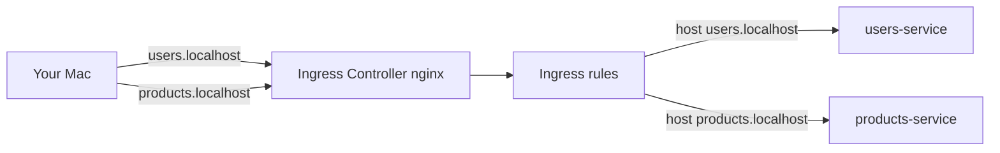

# Step 9: Ingress

**Goal:** Route HTTP traffic from your Mac into the cluster using **Ingress** — one entry point for both services, with host-based routing.

**Time:** ~25 minutes.

**Prerequisites:**

- [Step 8 – Health Probes](./08-health-probes.md) — both services `1/1 Ready`

---

## Before port-forward per service

| Step 6–8 approach | Step 9 approach |
|-------------------|-----------------|
| `port-forward users-service 3000:80` | One Ingress entry point |
| `port-forward products-service 3001:80` | Hostname picks the service |

---

## Architecture



| Hostname | Backend | Example |
|----------|---------|---------|
| `users.localhost` | `users-service` | `GET /api/v1/users` |
| `products.localhost` | `products-service` | `GET /api/v1/products` |
| `users.localhost` | `users-service` → cluster DNS → products | `GET /api/v1/products` |

We use **host-based routing** (not path prefixes like `/users/...`) because Rails expects API paths at `/api/v1/...`.

---

## 1. Install Ingress controller (kind)

kind does not include an Ingress controller by default. Install **ingress-nginx**:

```bash
kubectl apply -f https://raw.githubusercontent.com/kubernetes/ingress-nginx/main/deploy/static/provider/kind/deploy.yaml
```

Wait until ready:

```bash
kubectl wait --namespace ingress-nginx \
  --for=condition=ready pod \
  --selector=app.kubernetes.io/component=controller \
  --timeout=180s
```

Verify:

```bash
kubectl get pods -n ingress-nginx
kubectl get ingressclass
```

Expected IngressClass: `nginx`.

---

## 2. Apply Ingress rules

`k8s/ingress.yaml`:

```yaml
apiVersion: networking.k8s.io/v1
kind: Ingress
metadata:
  name: microservices-ingress
  namespace: microservices
  annotations:
    nginx.ingress.kubernetes.io/ssl-redirect: "false"
spec:
  ingressClassName: nginx
  rules:
    - host: users.localhost
      http:
        paths:
          - path: /
            pathType: Prefix
            backend:
              service:
                name: users-service
                port:
                  number: 80
    - host: products.localhost
      http:
        paths:
          - path: /
            pathType: Prefix
            backend:
              service:
                name: products-service
                port:
                  number: 80
```

Apply:

```bash
kubectl apply -f k8s/ingress.yaml
kubectl get ingress -n microservices
```

`ADDRESS` may stay empty on kind — that is normal.

---

## 3. Access from your Mac

### Option A — Port-forward to Ingress (works with any kind cluster)

One forward replaces per-service forwards:

```bash
kubectl port-forward -n ingress-nginx svc/ingress-nginx-controller 8080:80
```

Test (browser or curl — `*.localhost` resolves to `127.0.0.1` on macOS):

```bash
curl -s -o /dev/null -w "%{http_code}\n" http://users.localhost:8080/up
curl http://users.localhost:8080/api/v1/users
curl http://products.localhost:8080/api/v1/products
curl http://users.localhost:8080/api/v1/products   # cross-service
```

### Option B — Direct port 80 (recreate cluster with port mapping)

If your kind cluster was created with `kind create cluster --name microservices` only, **port 80 is not mapped** to your Mac. To use `http://users.localhost` without `:8080`, recreate the cluster with port mappings:

```bash
kind delete cluster --name microservices
kind create cluster --name microservices --config k8s/kind-config.yaml
```

Then redo Steps 3–8 (build images, deploy, secrets, PVCs, etc.) and install Ingress again.

After that:

```bash
curl http://users.localhost/api/v1/users
curl http://products.localhost/api/v1/products
```

See `k8s/kind-config.yaml` for the `extraPortMappings` configuration.

---

## 4. How Ingress differs from Service

| | Service (ClusterIP) | Ingress |
|---|---------------------|---------|
| **Scope** | Internal cluster networking | HTTP routing from outside |
| **DNS** | `users-service` inside cluster | `users.localhost` on your Mac |
| **Layer** | L4 (TCP port) | L7 (HTTP host/path) |
| **Needs controller** | No | Yes (nginx, traefik, etc.) |

Flow for `curl http://users.localhost:8080/api/v1/users`:

1. Request hits Ingress controller (port-forward or host port 80)
2. Ingress matches `host: users.localhost`
3. Forwards to `users-service:80`
4. Service routes to a Users Pod

---

## Inspect Ingress

```bash
kubectl describe ingress microservices-ingress -n microservices
kubectl get endpoints -n microservices users-service products-service
```

---

## Troubleshooting

### `curl: (7) Failed to connect`

- Ingress controller not ready: `kubectl get pods -n ingress-nginx`
- No port-forward and no host port 80 mapping — use Option A (`8080:80` forward)
- Wrong port — use `8080` unless you recreated kind with `kind-config.yaml`

### 404 Not Found

- Wrong `Host` header — use `users.localhost` or `products.localhost`, not bare `localhost`
- Ingress not applied: `kubectl get ingress -n microservices`

### 502 Bad Gateway

Backend Pods not Ready:

```bash
kubectl get pods -n microservices
kubectl logs -n microservices -l app=users-service --tail=20
```

Readiness probe failing — see Step 8.

### 308 redirect to HTTPS

Add annotation (already in our manifest):

```yaml
nginx.ingress.kubernetes.io/ssl-redirect: "false"
```

### `ADDRESS` empty on `kubectl get ingress`

Normal for kind without cloud LoadBalancer. Traffic still works via port-forward or NodePort.

---

## Cleanup Ingress (optional)

```bash
kubectl delete -f k8s/ingress.yaml
kubectl delete -f https://raw.githubusercontent.com/kubernetes/ingress-nginx/main/deploy/static/provider/kind/deploy.yaml
```

---

## Repeat later (checklist)

- [ ] ingress-nginx controller Running in `ingress-nginx` namespace
- [ ] `kubectl apply -f k8s/ingress.yaml`
- [ ] `kubectl port-forward -n ingress-nginx svc/ingress-nginx-controller 8080:80`
- [ ] `curl http://users.localhost:8080/up` → 200
- [ ] `curl http://users.localhost:8080/api/v1/products` → products JSON (cross-service)

---

## Next step

**Step 10:** Namespace cleanup, `kustomization.yaml`, and full teardown checklist — put the cluster away when you are done learning.

See: [10-cleanup-and-recap.md](./10-cleanup-and-recap.md)
