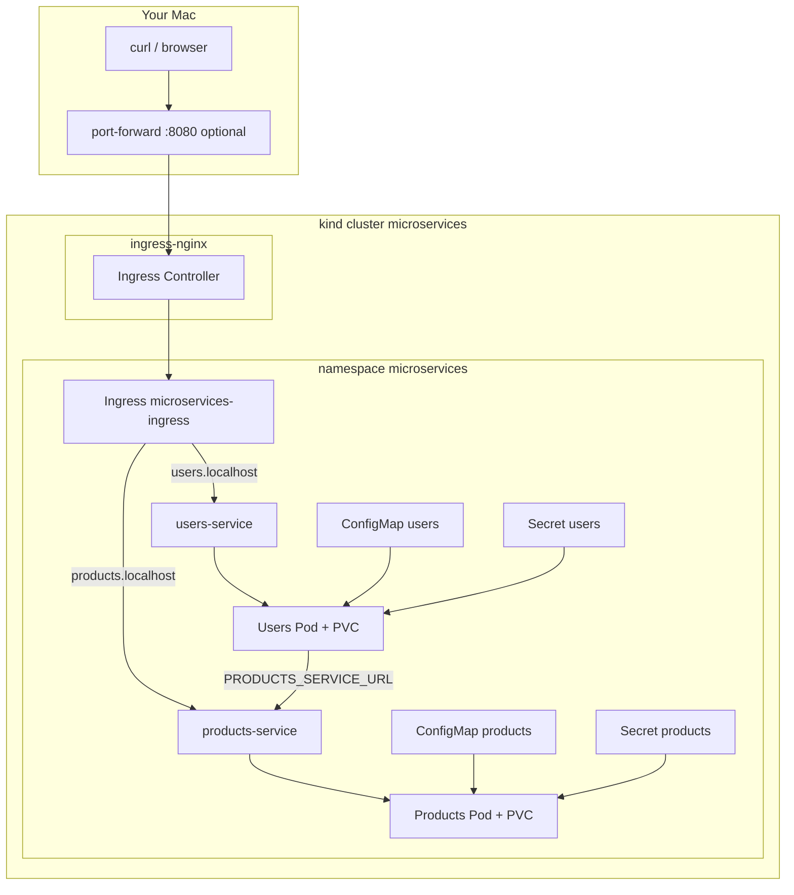

# Step 10: Cleanup, Recap & Repeat

**Goal:** Understand what you built, tear it down safely, and know how to run the full stack again from scratch.

**Time:** ~15 minutes reading; cleanup ~2 minutes.

**Prerequisites:** Steps 0–9 complete.

---

## What you built (recap)



### Journey summary

| Step | Topic | Key takeaway |
|------|-------|--------------|
| 0 | Mental model | Pod, Deployment, Service, Secret, PVC |
| 1 | kind cluster | Local Kubernetes in Docker |
| 2 | kubectl | `get`, `describe`, `logs`, `exec` |
| 3 | Docker images | Build + `kind load docker-image` |
| 4 | service2 deploy | Pod → Deployment + Service |
| 5 | Config & secrets | ConfigMap vs Secret, `envFrom`, DNS |
| 6 | service1 deploy | Cross-service HTTP via `products-service` |
| 7 | PVC | SQLite survives Pod restarts |
| 8 | Health probes | `/up` liveness + readiness |
| 9 | Ingress | `users.localhost` / `products.localhost` |

### Files in this repo

```
k8s/
├── kustomization.yaml      # apply all app manifests at once
├── kind-config.yaml        # optional: kind with host port 80
├── ingress.yaml
├── namespace.yaml
├── service1/
│   ├── configmap.yaml
│   ├── deployment.yaml
│   ├── service.yaml
│   ├── pvc.yaml
│   └── secret.yaml.example
└── service2/
    ├── configmap.yaml
    ├── deployment.yaml
    ├── service.yaml
    ├── pvc.yaml
    ├── pod.yaml            # learning only — not in kustomization
    └── secret.yaml.example

docs/kubernetes/              # step-by-step guides 00–10
scripts/k8s-build-images.sh # build + load both images
```

---

## Apply everything at once (Kustomize)

Secrets are **not** in git. Create them first, then apply manifests:

```bash
# From microservices-ruby root
kubectl config use-context kind-microservices

# 1. Secrets (once per cluster)
kubectl create secret generic users-service-secrets \
  --from-literal=RAILS_MASTER_KEY="$(cat service1/config/master.key)" \
  -n microservices --dry-run=client -o yaml | kubectl apply -f -

kubectl create secret generic products-service-secrets \
  --from-literal=RAILS_MASTER_KEY="$(cat service2/config/master.key)" \
  -n microservices --dry-run=client -o yaml | kubectl apply -f -

# 2. All app resources
kubectl apply -k k8s/

# 3. Wait for rollouts
kubectl rollout status deployment/users-service -n microservices
kubectl rollout status deployment/products-service -n microservices

# 4. Ingress controller (if not already installed)
kubectl apply -f https://raw.githubusercontent.com/kubernetes/ingress-nginx/main/deploy/static/provider/kind/deploy.yaml
kubectl wait --namespace ingress-nginx --for=condition=ready pod \
  --selector=app.kubernetes.io/component=controller --timeout=180s
```

Verify:

```bash
kubectl get all -n microservices
kubectl port-forward -n ingress-nginx svc/ingress-nginx-controller 8080:80
# curl http://users.localhost:8080/up
```

---

## Full teardown

### Level 1 — Delete app only (keep cluster)

Removes your microservices but keeps kind running:

```bash
kubectl delete namespace microservices
```

Also removes PVCs and data inside that namespace.

Re-deploy later: create secrets + `kubectl apply -k k8s/` + ingress controller if needed.

### Level 2 — Delete Ingress controller

```bash
kubectl delete -f https://raw.githubusercontent.com/kubernetes/ingress-nginx/main/deploy/static/provider/kind/deploy.yaml
```

### Level 3 — Delete entire cluster

```bash
kind delete cluster --name microservices
```

Removes all workloads, PVCs, secrets, and the kind node container.

Verify:

```bash
kind get clusters
# microservices should be gone

docker ps | grep microservices
# no control-plane container
```

---

## Repeat from scratch (full checklist)

Use this when starting on a new machine or after `kind delete cluster`:

### One-time setup

- [ ] Install Docker, `kubectl`, `kind`
- [ ] Clone repo with submodules: `git clone --recurse-submodules git@github.com:doston9471/microservices-ruby.git`
- [ ] `kind create cluster --name microservices` (or `--config k8s/kind-config.yaml` for port 80)

### Build & load

- [ ] `docker build -t service1:local ./service1`
- [ ] `docker build -t service2:local ./service2`
- [ ] `kind load docker-image service1:local service2:local --name microservices`
- [ ] Or: `./scripts/k8s-build-images.sh`

### Credentials

- [ ] `service1/config/master.key` matches `credentials.yml.enc` (with `secret_key_base`)
- [ ] Same for `service2`

### Deploy

- [ ] Create both Secrets (see Kustomize section above)
- [ ] `kubectl apply -k k8s/`
- [ ] Install ingress-nginx (Step 9)
- [ ] `kubectl get pods -n microservices` — all `1/1 Running`

### Smoke test

- [ ] `kubectl port-forward -n ingress-nginx svc/ingress-nginx-controller 8080:80`
- [ ] `curl http://users.localhost:8080/up` → 200
- [ ] `curl http://users.localhost:8080/api/v1/products` → JSON (cross-service)

---

## Common commands cheat sheet

```bash
# Context
kubectl config use-context kind-microservices
kubectl config current-context

# Status
kubectl get all -n microservices
kubectl get pvc,ingress -n microservices

# Logs
kubectl logs -n microservices -l app=users-service -f
kubectl logs -n microservices -l app=products-service --tail=50

# Restart after image rebuild
kind load docker-image service1:local --name microservices
kubectl rollout restart deployment/users-service -n microservices

# Debug
kubectl describe pod -n microservices -l app=users-service
kubectl exec -it -n microservices deploy/users-service -- sh

# Port-forward (without Ingress)
kubectl port-forward -n microservices svc/users-service 3000:80
kubectl port-forward -n microservices svc/products-service 3001:80

# Ingress entry point
kubectl port-forward -n ingress-nginx svc/ingress-nginx-controller 8080:80
```

---

## What to commit (git reminder)

| Repo | Commit |
|------|--------|
| **microservices-ruby** | `k8s/`, `docs/kubernetes/`, `scripts/` |
| **service1** submodule | `ProductService`, `credentials.yml.enc`, `Dockerfile` |
| **service2** submodule | `credentials.yml.enc`, `Dockerfile` |
| **Never commit** | `config/master.key`, Kubernetes Secret YAML with real keys |

After submodule commits:

```bash
git add service1 service2
git commit -m "Update service submodule pointers"
```

---

## Where to go next

| Topic | Idea |
|-------|------|
| **Helm** | Package `k8s/` as a chart with values for image tags |
| **CI/CD** | GitHub Actions → build images → deploy to cluster |
| **PostgreSQL** | Replace SQLite with a database Deployment or managed DB |
| **Cloud** | GKE, EKS, AKS — same manifests, different Ingress/LB |
| **Observability** | Prometheus, Grafana, structured Rails logs |
| **NetworkPolicy** | Restrict which Pods can talk to each other |

---

## Congratulations

You ran a **two-service Rails system** on Kubernetes:

- Built and loaded local Docker images
- Deployed with Deployments, Services, ConfigMaps, and Secrets
- Connected services over cluster DNS
- Persisted SQLite with PVCs
- Added health probes and Ingress

That is a solid foundation for production-oriented learning. Keep the `docs/kubernetes/` folder — it is your repeatable playbook.

---

## Doc index

| Step | Guide |
|------|-------|
| 0 | [00-kubernetes-mental-model.md](./00-kubernetes-mental-model.md) |
| 1 | [01-cluster-setup.md](./01-cluster-setup.md) |
| 2 | [02-kubectl-basics.md](./02-kubectl-basics.md) |
| 3 | [03-build-and-load-images.md](./03-build-and-load-images.md) |
| 4 | [04-deploy-service2.md](./04-deploy-service2.md) |
| 5 | [05-secrets-and-config.md](./05-secrets-and-config.md) |
| 6 | [06-deploy-service1.md](./06-deploy-service1.md) |
| 7 | [07-persistent-storage.md](./07-persistent-storage.md) |
| 8 | [08-health-probes.md](./08-health-probes.md) |
| 9 | [09-ingress.md](./09-ingress.md) |
| 10 | This guide |
